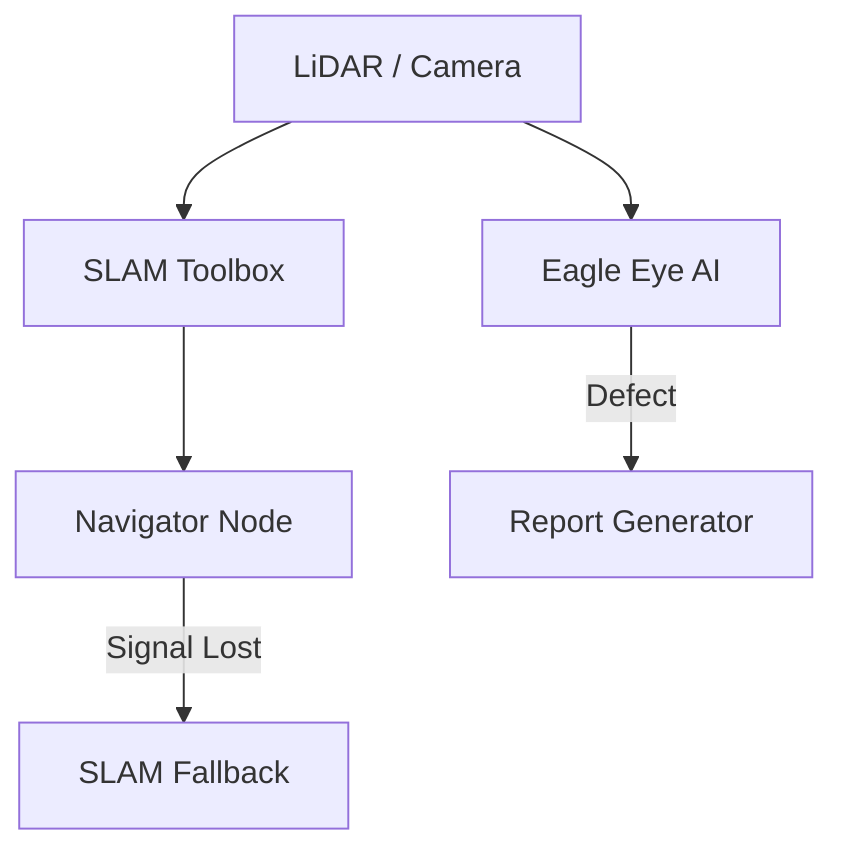

# Project CHRONOS: Autonomous Infrastructure Inspection


[](https://docs.ros.org/en/jazzy/index.html)

Project CHRONOS is a professional autonomous UAV stack designed for high-reliability bridge and power-tower inspections. It excels in GPS-denied environments using SLAM-based fallback and AI-driven defect detection.

## 🚀 Key Features
*   **GPS-Denied Resilience:** Automatic navigation fallback to SLAM when GPS signal is blocked by structures.
*   **Eagle Eye AI:** Real-time identification of rust, cracks, and loose bolts using YOLO-inspired perception.
*   **Mission Reporting:** Automated generation of professional engineering summaries for maintenance teams.
*   **Full Simulation:** Tested in high-fidelity Gazebo worlds with simulated sensor noise and wind.

## 🧠 Architecture


## 🛠️ Installation
```bash
# Clone the repository
git clone https://github.com/yogesh031020/Project-CHRONOS-Infrastructure-Inspection.git

# Build with Colcon
colcon build --packages-select chronos_inspector

# Launch the system
ros2 launch chronos_inspector chronos_nav_launch.py
```

---
*Developed by Yogesh - Autonomous Systems Engineer.*
